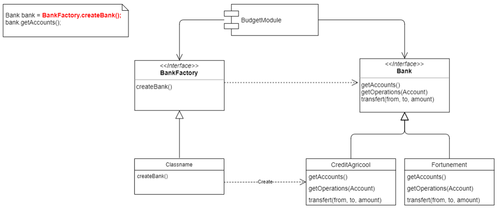

# DI container

Afin de mieux comprendre le principe d'injection de dépendances, l'objectif de ce TD est de construire un Conteneur d'injection de dépendances. 

Comme souvent, il n'y a pas de solution unique et ce sera à vous de construire votre propre Conteneur DI avec les techniques qui vous semblent les plus pertinentes. Le langage Java offre diverses possibilités (les génériques, les annotations, la reflexion...) vous permettant de construire un Conteneur fonctionnel et élégant.  

Ce TD est noté mais ne vous focalisez pas sur la note, l'idée étant surtout de pratiquer, de se poser des questions et de mettre en oeuvre les concepts vus en cours. L'important n'est pas d'arriver absolument à la fin du TD, mais plutôt de bien comprendre ce que vous faites, de faire un code propre et testé. Avancez à votre rythme.

N'oubliez pas qu'il y a des outils open source permettant d'identifier un code copié ;) Si vous utilisez le code de quelqu'un, mentionnez le mais l'objectif de ce TP est de pratiquer donc la note s'en ressentira. Inutile de vous dire que le plagia est fortement pénalisé...   

Le design de votre Conteneur, sa testabilité, le niveau de test, l'isolation des différentes responsabilités, le niveau de couplage entre les classes de votre Conteneur seront autant de points qui seront pris en compte sur l'évaluation de votre travail.

Vous aurez 4 TD pour réaliser ce Conteneur. 


## Objectif du Conteneur
L'objectif de Conteneur d'injection de dépendances est de mettre en place un couplage faible entre les différentes parties d'une application. A ce titre, votre Conteneur devra donc fournir les méthodes nécessaires pour injecter des objets ou des valeurs au sein d'autres objets permettant ainsi d'assembler les composants d'une application.

Prenons un exemple simple, imaginez une classe MovieLister (thx Fowler) qui fournit des listes ordonnées et classifiées de films. MovieLister va utiliser MovieFinder qui aura la responsabilité de rechercher des films. Plusieurs implémentations de MovieFinder existent, WebMovieFinder, DbMovieFinder, FileMovieFinder... Chacune de ces implémentations va utiliser un AuditService, qui devra enregistrer toutes les requêtes effectuées pour des questions de tracabilité. Plutôt que de manuellement instancier un MovieLister, un MovieFinder et un AuditService, l'idéal serait d'utiliser notre Conteneur pour réaliser tout cet assemblage, cela permettra en plus de complètement découpler la classe MovieLister des MovieFinders.

Exemple de code :
```java
AwesomeConteneur Conteneur = new AwesomeConteneur();
Conteneur.register(AuditService.class, SimpleAuditService.class);
Conteneur.register(MovieFinder.class, WebMovieFinder.class);

MovieLister movieLister = Conteneur.getInstance(MovieLister.class);

List<Film> films = movieLister.getActorFilms("De Funes");
```   

La définition de l'association entre classes et interfaces peut être réalisé de différentes manières. Par exemple Spring utilisait et utilise encore le format XML :
```xml
<beans>
  <bean id="auditServiceBean" class="org.isima.javapro.SimpleAuditService">
    <property name="path" value="/data/audit"/>
  </bean>
  <bean id="movieFinderBean" class="org.isima.javapro.WebMovieFinder">
    <property name="auditService" ref="auditServiceBean"/>
  </bean>
  <bean id="movieLister" class="org.isima.javapro.MovieLister">
    <property name="movieFinder" ref="moviefinderBean"/>
  </bean>
</beans>
```

Lors du premier TP, vous avez utilisé une autre façon pour définir les dépendances à injecter : les annotations.  
A vous de choisir qu'elle solution vous convient le mieux. Vous êtes libre de proposer votre propre solution.


## Conteneur

### 1 - Le conteneur
Le conteneur est par définition un élément central du conteneur d'injection de dépendances. Son rôle va être d'enregistrer les dépendances et de gérer leur cycle de vie (création, stockage et destruction). Comme il va maintenir l'ensemble des dépendances enregistrées, il va aussi être responsable de fournir les dépendances qu'on va lui demander. Donc Le conteneur a ces deux responsabilités :  
  - Enregistrer une dépendance en exposant une méthode register par exemple.
```java
void register(Class<T> dependency)
```
  - Fournir une instance d'une dépendance en exposant une méthode newInstance par exemple.
```java
T newInstance(Class<T> dependency)
```
Le container ne vas pas réinstancier une dépendance préalablement instanciée. Il devra fournir l'instance déjà créée.


### 2 - Binding object
On a vu en cours que pour éviter un couplage fort entre classes, il est préférable de dépendre d'abstractions plutôt que d'implémentations.  
Reprenons l'exemple de l'interface Bank et des classes d'implémentations CreditAgricool et Fortunement :  

  

Dans cet exemple, plutôt que le BudgetModule instancie lui même un object de type Bank, il va demander à votre conteneur DI un objet de type Bank. Pour que le conteneur puisse injecter une instance concrète (CreditAgricool ou Fortunement), il faudra préalablement faire l'association entre Bank et cette implémentation.  
Votre conteneur devra donc exposer une méthode permettant de définir une association entre une abstraction (Interface ou classe abstraite) et une implémentation. Ainsi, lorsqu'une classe demandera à votre container un objet de type Bank, il lui fournira soit un objet de type CreditAgricool ou Fortunement en fonction de l'association fournie au conteneur.  


## 3 - Injection
Pour réaliser l'injection d'une dépendance, il vous faudra trois éléments :  
 - Où faut-il réaliser l'injection
 - Quelle dépendance injecter
 - L'injection à proprement parler  

Pour savoir où realiser l'injection, un moyen simple et efficace est celui que vous avez déjà manipuler avec SpringBoot, une annotation. Elle permettra aux utilisateurs de votre conteneur DI de préciser où souhaitent-ils réaliser l'injection.  
Pour savoir qu'elle dépendance injecter, il y a deux stratégie possible : par nom et par type. Votre conteneur connait toutes les dépendances préalablement référencées, servait vous en.
    
Enfin, l'injection pourra se réaliser simplement à l'aide de l'API Reflection.  

Votre conteneur devra donc injecter toutes les dépendances nécessaires à la création d'une instance. Lorsqu'une nouvelle instance d'une classe est demandé au conteneur, celui la créer et se charge d'injecter toutes les dépendances dont-elle à besoin.


### Injection par constructeur
Votre conteneur devra être en mesure d'injecter une ou des dépendances via le constructeur d'une classe. Seul les constructeurs définis comme injectables par l'utilisateur devront servir à l'injection d'une dépendance. 

### Injection par attribut
Votre conteneur devra être en mesure d'injecter une ou des dépendances directement dans les attributs d'une classe. Seul les attributs définis comme injectables par l'utilisateur devront servir à l'injection d'une dépendance. La visibilité des attributs devra être géré, les attributs private et protected étant injectable eux aussi. 

## Fonctionalités optionelles

### 7 - Scan de packages et auto-registering
Jusqu'a présent il était nécessaire d'enregistrer chaque dépendance via la methode register. Pour simplifier l'usage de votre conteneur, implémentez un scanner de package permettant d'enregistrer automatiquement les dépendances dans votre conteneur.
Toutes les classes d'un package ne doivent pas être enregistrées. Mettez à disposition des développeurs qui vont utiliser votre conteneur un moyen pour définir les classes que votre scanner  

### 8 - Résolution de graphe
On l'a vu en cours, un des intérêts d'un Conteneur et de créer et d'assembler tout un graphe d'objet et pas simplement injecter une dépendance. La réalisation de cette fonctionalité doit permettre d'assembler un graphe complexe d'objet. Imaginons une classe A ayant une dépendance de type B et C, elles mêmes dépendantes d'un objet de type D ayant une dépendance sur E :
```
     +---> B --+     
A ---|         |---> D ---> E
     +---> C --+
```
Attentions aux cycles !


## Contraintes
Maven, Java et tests unitaires !


## Testabilité
Comme pour tout programme informatique, les tests ne sont pas en option et il est aujourd'hui impensable de développer sans rédiger un ensemble de tests garantissant un minimum de robustesse à votre programme. En plus de vous assurer le bon fonctionnement de votre Conteneur, les tests vous seront utiles pour réfléchir à comment il doit être utilisé. Une bonne pratique issue du TDD (Test Driven Development) est de commencer par rédiger les tests afin de bien définir quelles seront les fonctionnalités à implémenter et quel sera le design de votre Conteneur. Pour vous aider à démarrer, voici un exemple de tests d'un Conteneur DI :  
```java

public class InjectorTest {

    Injector injector;

    @BeforeEach
    void createInjector() {
        injector = new Injector();
    }

    @Test
    @DisplayName("Test simple injection")
    void testSimpleInjection() {
        try {
            injector.bind(HttpService.class).to(DarkWebHttpService.class);
            injector.bind(NewsService.class).to(RssNewsService.class);

            NewsService newsService = injector.newInstance(NewsService.class);
            assertTrue(newsService.getHttpService() instanceof DarkWebHttpService);
        } catch (BindingException e) {
            fail("Test fail because of binding error. " + e.getMessage());
        }
    }
}
```
Les dépendances Maven utilisées pour ces tests sont :
```xml
<dependency>
    <groupId>org.junit.jupiter</groupId>
    <artifactId>junit-jupiter-engine</artifactId>
    <version>5.1.0</version>
    <scope>test</scope>
</dependency>

<dependency>
    <groupId>org.junit.platform</groupId>
    <artifactId>junit-platform-launcher</artifactId>
    <version>1.1.0</version>
    <scope>test</scope>
</dependency>
```

A vous de jouer ! Et surtout n'hésitez pas à poser des questions, ceci est un TD !

